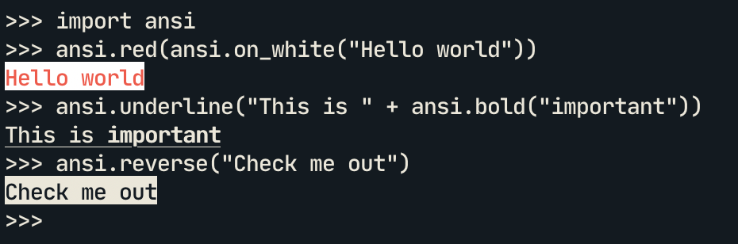

# ansi.v

Colors in your terminal for the V programming language

Works on MacOS, Linux, Windows

--------

#### Styles
- `ansi.reset`
- `ansi.bold`
- `ansi.dim`
- `ansi.underline`
- `ansi.blink`
- `ansi.reverse`
- `ansi.hidden`

#### Foreground Colours
- `ansi.black`
- `ansi.red`
- `ansi.green`
- `ansi.yellow`
- `ansi.blue`
- `ansi.magenta`
- `ansi.cyan`
- `ansi.white`

#### Background Colours
- `ansi.on_black`
- `ansi.on_red`
- `ansi.on_green`
- `ansi.on_yellow`
- `ansi.on_blue`
- `ansi.on_magenta`
- `ansi.on_cyan`
- `ansi.on_white`
